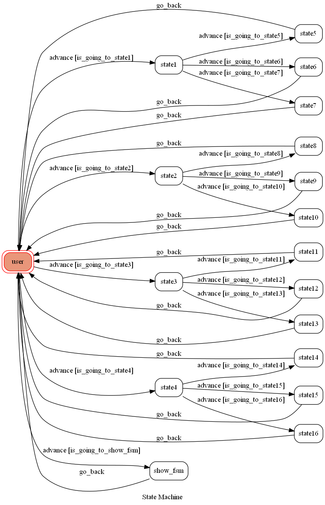

# TOC-FinalProject

### Environment
* Python 3.7
* Anaconda3
* Win10

### Finite State Machine


### Connect to Heroku
CLI Login
	`heroku login`
### Upload project to Heroku
1. Push Steps
	```
	git init
	heroku git:remote -a {HEROKU_APP_NAME}
	git add .
	git commit -am "make it better"
	heroku buildpacks:set heroku/python
	heroku buildpacks:add --index 1 heroku-community/apt
	git push heroku master
	```

2. Set Environment - Line Messaging API Secret Keys
	```
	heroku config:set LINE_CHANNEL_SECRET=your_line_channel_secret
	heroku config:set LINE_CHANNEL_ACCESS_TOKEN=your_line_channel_access_token
	```